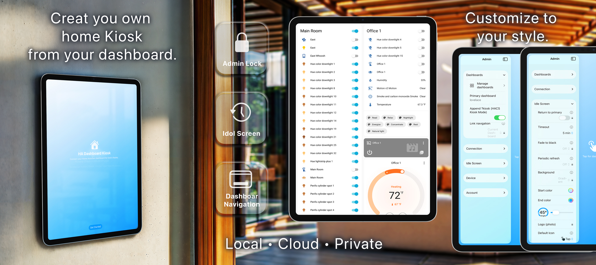
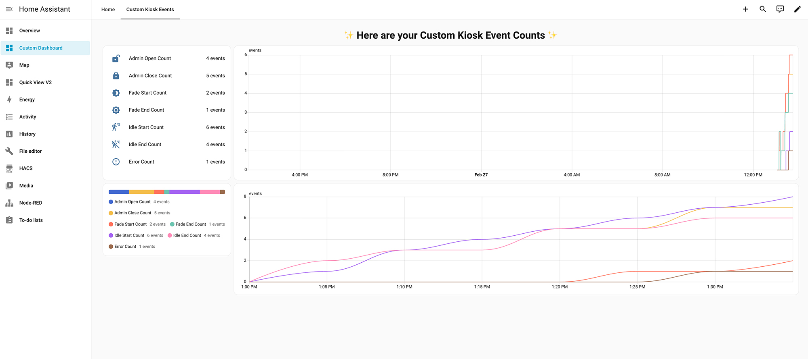

# Custom Kiosk Events

Home Assistant custom integration that extends the **HA Dashboard Kiosk** iOS app with more features in HA: webhook/REST event ingestion, sensors and counters, and events for automations. Use this HACS integration together with the app—no manual blueprints or helpers required.

**App & documentation:** [hacustomkiosk.com](https://hacustomkiosk.com) — iOS app download, setup guide, and full docs.

|  |
|--------------------------|

|  |
|---------------------------------------------|

The second screenshot shows example **Entities**, **Distribution**, **History graph**, and **Statistics graph** cards using the event counters provided by this integration with default Home Assistant styling.

---

## Installation

**Use HACS (recommended):**

1. Open **HACS → Integrations**.
2. Click the menu (⋮) → **Custom repositories**.
3. Add this repository URL as type **Integration**.
4. Search for **Custom Kiosk Events** and install.
5. Restart Home Assistant.
6. Go to **Settings → Devices & services** → **Add Integration** → search **Custom Kiosk Events**.

Follow the config flow to set a name, webhook behavior, and optional notifications (error / admin open).

---

## Important info

- **Webhook ID:** The integration uses a fixed webhook ID (`ha-dashboard-kiosk-wh`) so the app does not need reconfiguring if you used the original blueprint.
- **Single instance:** One integration instance is typical; it handles all kiosk devices that send events to the same webhook or REST endpoint.
- **App setup:** Configure the iPad app to send events to Home Assistant (REST or webhook) as described at [hacustomkiosk.com](https://hacustomkiosk.com).

---

## What you get

| Feature | Description |
|--------|-------------|
| **Webhook / REST** | Receives events from the app at `/api/webhook/ha-dashboard-kiosk-wh` or via `ha_dashboard_kiosk` REST events. |
| **Sensors** | Last event, total events, and per-type counters (idle start/end, fade start/end, admin open/close, error). |
| **Events** | Fires `kiosk_event_received` with `event`, `timestamp`, `idle_reason`, `error_type` for your automations. |
| **Notifications** | Optional persistent notifications when the admin panel is opened or when an error is reported. |
| **Logbook** | Kiosk events are logged for history and debugging. |

---

## Config flow options

| Option | Default | Description |
|--------|---------|-------------|
| **Name** | Custom Kiosk Events | Friendly name for the integration and entity names. |
| **Fire events** | On | Fire `kiosk_event_received` so automations can react. |
| **Notify on error** | On | Send a persistent notification when the app reports an error. |
| **Notify on admin open** | Off | Send a notification when someone opens the admin panel on the kiosk. |

---

## Usage

After setup you get entities such as:

- **Last Event** — last kiosk event type (and device).
- **Total Events** — count of all events received.
- **Idle Start / Idle End / Fade Start / Fade End / Admin Open / Admin Close / Error** — per-type counters.

Use them in:

- **Lovelace** — statistics, history graph, or any card.
- **Automations** — triggers or conditions on `kiosk_event_received` or sensor states.

Full app setup and “Send events to HA” configuration: [hacustomkiosk.com](https://hacustomkiosk.com).

---

## Kiosk mode (app + dashboard URL)

Used together with the **HA Dashboard Kiosk** iOS app, the dashboard URL supports **`?kiosk-mode`** so the app can present a kiosk-style view (e.g. hide navigation). Configure the dashboard URL in the app; see [hacustomkiosk.com](https://hacustomkiosk.com) for details.

For more URL-based hiding options in the browser (e.g. header/sidebar), see [kiosk-mode](https://github.com/NemesisRE/kiosk-mode) (Lovelace frontend, FYI).

---

## Related

- [HA Dashboard Kiosk (iOS app) & docs](https://hacustomkiosk.com)
- [kiosk-mode](https://github.com/NemesisRE/kiosk-mode) — Lovelace frontend for hiding header/sidebar via URL params in the browser (FYI).

---

## Credit

This integration replaces the manual blueprint + counter-helpers setup.
